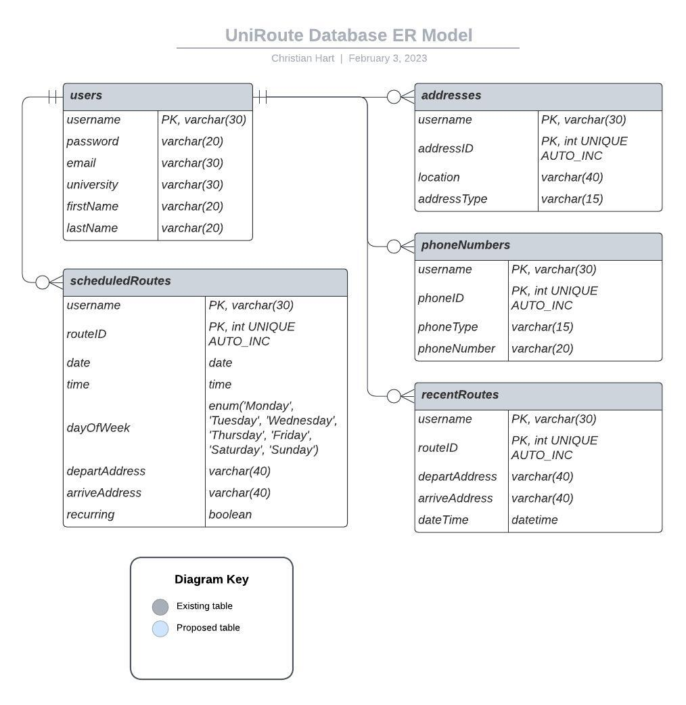

# UniRoute Database

## MySQL

In the interest of upping our familiarity with MySQL, we have opted to use this language to design our database. Through flask we will be able to alter and query the database in order to store necessary user information.

## ER Model

Our database will be used to record user profiles, their related tables, and their attributes. Below is our entity-relationship model that the database is built from:



## Code

To initialize the database, the following code must be run:

```
CREATE DATABASE UniRouteDB;
CREATE TABLE users (
	username varchar(30) NOT NULL,
    password varchar(20),
    email varchar(30) NOT NULL,
    university varchar(30),
    firstName varchar(30),
    lastName varchar(30),
    PRIMARY KEY (username)
);
CREATE TABLE addresses (
	username varchar(30) NOT NULL,
    addressID int UNIQUE AUTO_INCREMENT NOT NULL,
    location varchar(40) NOT NULL,
    addressType varchar(15),
    PRIMARY KEY (username, addressID),
    FOREIGN KEY (username) REFERENCES users(username)
		ON DELETE CASCADE
        ON UPDATE CASCADE
);
CREATE TABLE phoneNumbers (
	username varchar(30) NOT NULL,
    phoneID int UNIQUE AUTO_INCREMENT NOT NULL,
    phoneNumber varchar(20) NOT NULL,
    phoneType varchar(15),
    PRIMARY KEY (username, phoneID),
    FOREIGN KEY (username) REFERENCES users(username)
		ON DELETE CASCADE
        ON UPDATE CASCADE
);
CREATE TABLE recentRoutes (
	username varchar(30) NOT NULL,
    routeID int UNIQUE AUTO_INCREMENT NOT NULL,
    departAddress varchar(40),
    arriveAddress varchar(40) NOT NULL,
    PRIMARY KEY (username, routeID),
    dateTime datetime,
    FOREIGN KEY (username) REFERENCES users(username)
		ON DELETE CASCADE
        ON UPDATE CASCADE
);
CREATE TABLE scheduledRoutes (
	username varchar(30) NOT NULL,
    routeID int UNIQUE AUTO_INCREMENT NOT NULL,
    date date,
    time time,
    dayOfWeek enum('Monday', 'Tuesday', 'Wednesday',
		'Thursday', 'Friday', 'Saturday', 'Sunday'),
    departAddress varchar(40),
    arriveAddress varchar(40) NOT NULL,
    PRIMARY KEY (username, routeID),
    dateTime datetime,
    FOREIGN KEY (username) REFERENCES users(username)
		ON DELETE CASCADE
        ON UPDATE CASCADE
);
```
