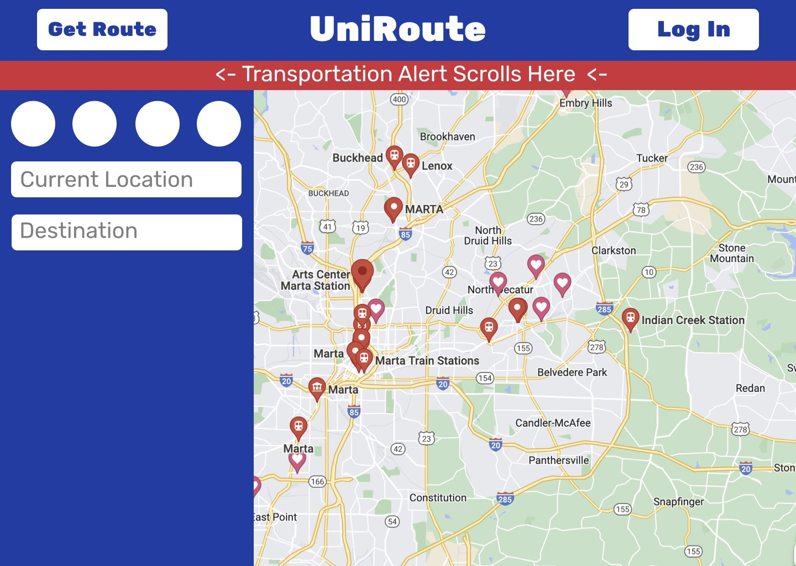
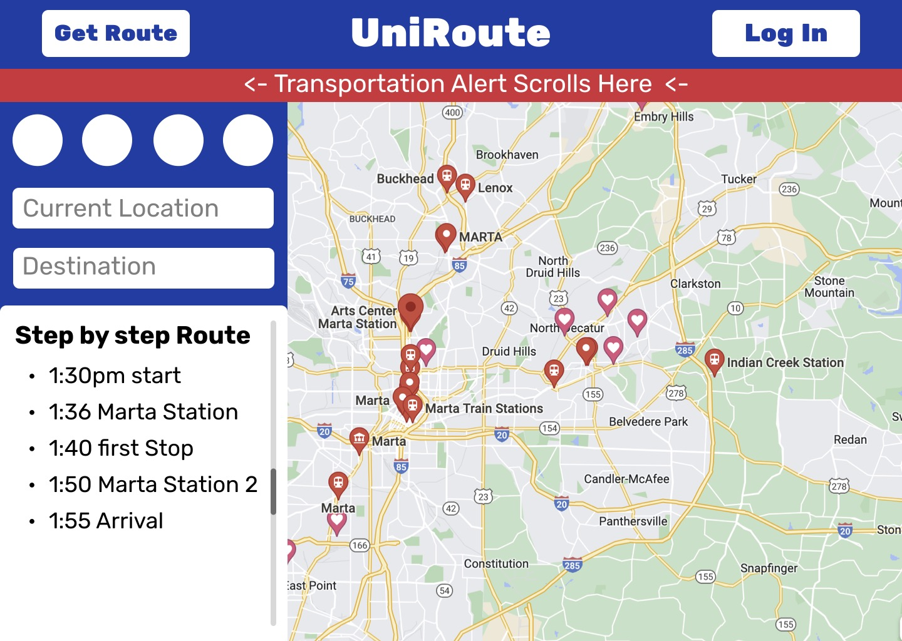
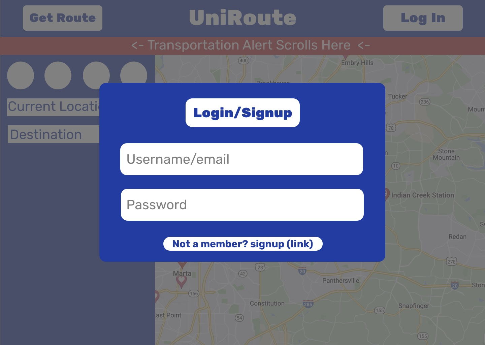
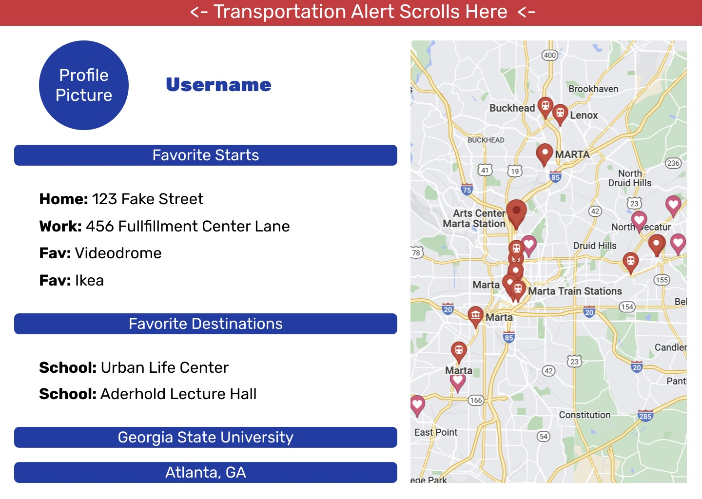

# 1. Introduction

## 1.1 Purpose

- The purpose of UniRoute is to provide an simple one-stop app to generate routes based on public transit, given starting point, destination, and arrival time.

## 1.2 Intended Audience

- For this document, our intended audience is for us and our instructor.

## 1.3 Intended Use

- This document is the layout of the project goals and objectives that are needed to complete each task while maintaining a timeline of the completion of each milestone in a set schedule, as well as anticipate assumptions and dependencies of the project.

## 1.4 Scope

- UniRoute is intended for college students attending big city Universities to get to and from class in a quick and efficient fashion without having to deal with the uncertainty of public transport. Users will be able to put in a destination and find the quickest route utilizing both city public transport (i.e bus, train, etc) and school transport systems. To make the process more streamlined and unique, one may input their weekly class schedule and destinations to have a route set up for you every day of the week and give precise times to leave based on traffic and other possible delays.

## 1.5 Definitions and Acronyms

- UniRoute
  : the entire application
- API
  : application programming interface

# 2. Overall Description

## 2.1 User Needs

User Stories:

1.  The user can enter a starting point and destination to get an immediate route without leaving the home page.
    Acceptance criteria:

    - Interactive map on home page
    - Input forms must be available that pass the addresses and/or times needed to fulfill the request
    - The necessary API query needs to be made to determine the ideal route
    - The query will return a display of the route on the interactive map and a step-by-step breakdown of the route.

2.  A "news ticker" style display above the map will show weather, traffic and accessibility alerts that could affect user commutes.
    Acceptance criteria:

    - The user can choose to receive notification via SMS of current weather, traffic, and accessibility alerts.
    - The app will make a request from the Weather API, Marta public transport API, and university public transport API and it will query and return the current weather and traffic.
    - The user will receive alerts on current traffic from public transportation and university transportation.
    - Requests need to be made to fill a scroll bar with current headlines related to weather and traffic headlines in the city (like a news ticker).

3.  From the homepage the user can specify their preferred mode of transportation (transit, car, walk, e-scooter).
    Acceptance criteria:

    - The routing algorithm should take into account user selected settings regarding transportation.
    - The setting can be manually chosen when making a new route request. If the user is logged in, this field will pre-populate with the user’s profile preference or most recently selected method.
    - Based on the chosen method, the algorithm should return a route that primarily utilizes that method.
    - Optional feature: incorporate e-scooter API information to find nearby e-bikes and e-scooters that the user can walk to.

4.  The user can create an account and save addresses to their _Favorites_ list.
    Acceptance criteria:

    - User information needs to be saved in a database, with necessary authentication to verify access privileges.
    - Within the user’s profile there will be a list of saved addresses that the user can edit.
    - There will be an input field for adding new addresses to the _Favorites_ list.
    - Each item in the _Favorites_ list can be removed with a single button press.

5.  With an account, the user can create a weekly schedule for their commute.
    Acceptance criteria:

    - Within a user’s profile there needs to be input fields that can save addresses and arrival times for each day of the week.
    - The user’s schedule needs to be saved in a database.
    - Allow the user to make a route query that uses their schedule as input.
    - The user should be able to view their schedule in a calendar format.

6.  With an account, once the user has populated their weekly schedule they can press a button to receive a full breakdown of their commute for that week.
    Acceptance criteria:

    - Show each day’s suggested leave time/arrival time to and from their desired locations.
    - Provide notification to the user to update their leave and arrival times if any delays happen.
    - Visualize the routes of each day by selecting them one by one and highlighting them on the interactive map.
    - Create routes based on their preferences saved in their account.

7.  The user can send a particular route or weekly schedule to their phone via SMS.
    Acceptance criteria:

    - Save the user’s phone number to their account so that the application can send them a notification
    - Connect SMS capabilities to the application so user may receive the messages
    - Format the route information to be easily readable in text form on phones
    - There should be a share button the user can use to send route information to other people.

8.  The user can select different universities or cities as their “home” map and save those settings to their account.
    Acceptance criteria:

    - Have access to and implement different university transit systems' APIs
    - Have the ability to select what the routing algorithm takes into account depending on user preferences.
    - Visualize the transit system routes on the map to give users a better understanding of their route
    - Save preferences in a database attached to their account so it does not have to be reselected after every use

## 2.2 Assumptions and Dependencies

- UniRoute requires other services to function properly. This includes the google maps API, MARTA API, and school transport API.

# 3. System Features and Requirements

## 3.1 Functional Requirements

- Authentication so users may login and save their preferences, schedules, and destinations.
- Access to API’s of the desired public transports
- Access to Navigation and Location API’s
- Access to Weather services to update possible delays
- Database to store user preferences and data

## 3.2 External Interface Requirements

## 3.3 System Requirements

-A computer, a modern browser, and access to the internet

## 3.4 Nonfunctional Requirements

- Data storage optimization for scalability to other Universities and more users
- Easy to read and use UI to have a seamless user experience.
- Secure encryption so no one can access our user’s personal data (except of course the companies we sell their data to.)

